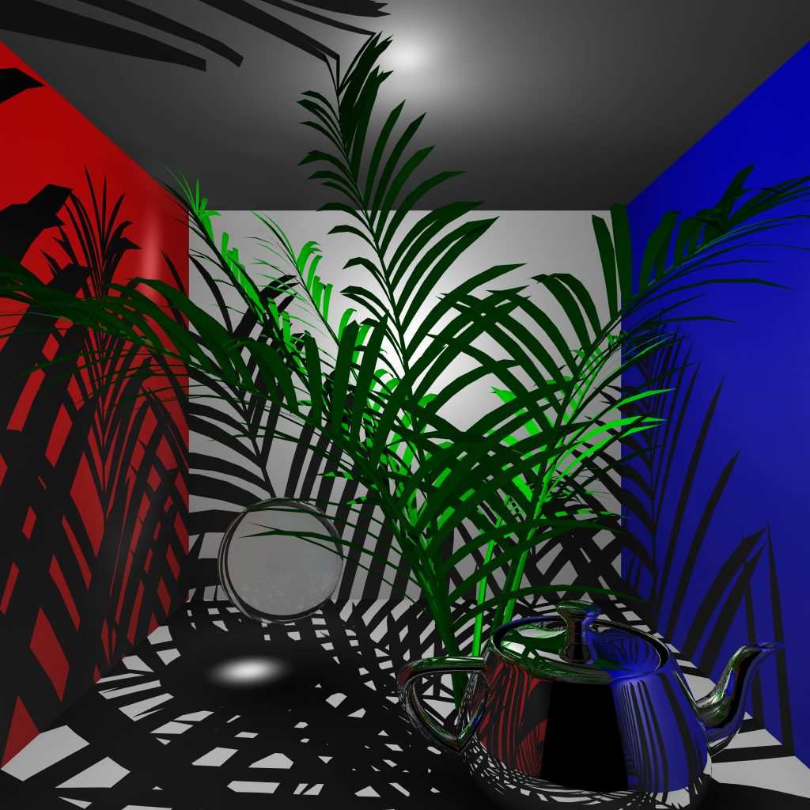

# Raytracing Renderer in Rust

  
_A high-quality rendered 3D scene using my Raytracing Renderer._

## Overview

This project is a **Raytracing Renderer** built from scratch in **Rust**. It is capable of rendering realistic 3D scenes into high-quality 2D images. The renderer produces realistic effects such as shadows, reflections, and refractions, and can approximate the behavior of light using photon mapping which produce advanced effects such as caustics.

## Features

- **Shadows, Reflections, and Refractions**: Enhances the realism of rendered scenes.
- **Ambient Occlusion**: Adds depth by approximating how exposed each point is to ambient lighting.
- **Photon Mapping**: Simulates the transport of light for global illumination.
- **Multithreading Optimisation**: Significantly reduces rendering times by parallelising computations.
